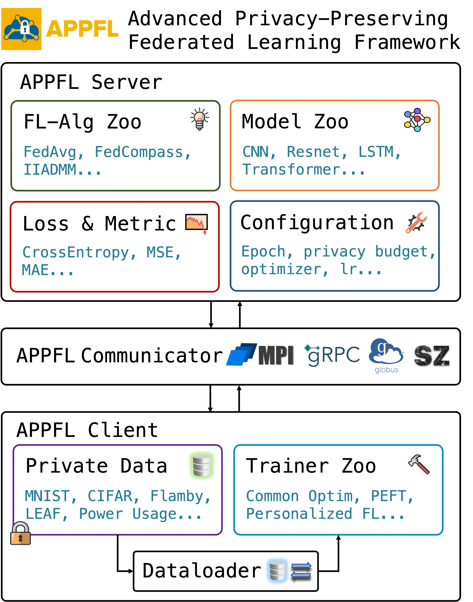

# APPFL: Argonne Privacy-Preserving Federated Learning


[](https://zenodo.org/badge/latestdoi/414722606)
[](https://appfl.readthedocs.io/en/latest/?badge=latest)

[](https://github.com/APPFL/APPFL/actions/workflows/build.yml)

Argonne Privacy-Preserving Federated Learning (APPFL) is an open-source software framework that allows research communities to implement, test, and validate various ideas for privacy-preserving federated learning (PPFL).
With this framework, developers and/or users can

- train a user-defined neural network model on **decentralized data with differential privacy**,
- **simulate** various PPFL algorithms on high-performance computing (HPC) architecture with MPI,
- implement **user-defined PPFL algorithms** in a plug-and-play manner.

Such algorithmic components include federated learning (FL) algorithm, privacy technique, communication protocol, FL model to train, and data.

- [Documentation](http://appfl.rtfd.io/): please check out the documentation for tutorials, users guide, and developers guide.

## Installation

We highly recommend to create new Conda virtual environment and install the required packages for APPFL.

```shell
conda create -n APPFL python=3.8
conda activate APPFL
```

### User installation

For most users such as data scientists, this simple installation must be sufficient for running the package.

```shell
pip install pip --upgrade
pip install "appfl[analytics,examples]"
```

If we want to even minimize the installation of package dependencies, we can skip the installation of a few pacakges (e.g., `matplotlib` and `jupyter`):

```shell
pip install "appfl"
```

### Developer installation

Code developers and contributors may want to work on the local repositofy. 
To set up the development environment, 

```shell
git clone https://github.com/APPFL/APPFL.git
cd APPFL
pip install -e ".[dev,examples,analytics]"
```
On Ubuntu:
If the install process failed, you can try:
```shell
sudo apt install libopenmpi-dev,libopenmpi-bin,libopenmpi-doc
```

## APPFL Framework Design


In the design of APPFL framework, we decompose an execution of federated learning experiment into three main components, *APPFL Server*, *APPFL Communicator*, and *APPFL Client*. The details and sub-components of these three are detailed as follows:

- APPFL Server: APPFL server orchestrates the whole FL experiment run by providing the model architecture, loss and metric, and configurations used in the training, and aggregating the client trained models synchronously or asynchronously using certain federated learning algorithms.
    
    - Model Zoo [[examples/models]](examples/models/) - This folder contains model architectures used in the given examples, and users can define their own arch for use.
    - Loss [[examples/losses]](examples/losses/) - This folder contains commonly used loss function in ML, and users can define their own loss by inheritting `nn.Module`.
    - Metric [[examples/metric]](examples/metric/) - This folder contains commonly used evaluation metric for checking the performance of the model.
    - Configuration - As shown in all the example scripts in the `examples` directory, users can setup the configurations and hyperparameters by passing arguments to the FL experiment runs.
    - FL-Alg Zoo [[src/appfl/algorithm]](src/appfl/algorithm/) - This folder contains serveral popular FL aggregation algorithms. 
- APPFL Communicator [[src/appfl/comm]](src/appfl/comm/): The communicator is used for exchanging metadata as well as the model weights between the server and clients. We currently support the following three communication protocols for different use cases.
    
    - MPI - Used for simulating FL experiment on one machine or HPC.
    - gRPC - Used for both simulating FL experiments on one machine or HPC, and running FL experiments on distributed machines.
    - [Globus Compute](https://funcx.readthedocs.io/en/latest/index.html) - Used for **easily** running FL experiments on distributed and heterogeneous machines.
- APPFL Client: APPFL clients have local dataset on disk and and use dataloader to load them for the local trainer to train local models.
    - Private Data - Each client should have on-premise private local datasets on their computing machine. For example scripts in the `examples` directory, we use `examples/datasets/RawData` to store the private datasets.
    - Dataloader [[examples/dataloader]](examples/dataloader/) - Dataloader is used to load the datasets from the storage for the trainer to use. The dataloaders in `examples/dataloader` provide a test dataset and several training datasets (one for each client) for the federated learning experiments in the MPI setting.
    - Trainer Zoo [[src/appfl/algorithm]](src/appfl/algorithm/) - This folder contains serveral commonly used local training algorithms, such as algorithm for training a model for a certain number of epochs or batches and algorithm for training a personalized FL model.

## Acknowledgements

This material is based upon work supported by the U.S. Department of Energy, Office of Science, under contract number DE-AC02-06CH11357.
