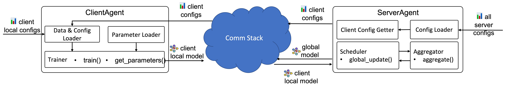

# Design Document for APPFL Package

## APPFL Workflow 
<p align="center">
  
</p>

## Code Structure for the Package
```
src
├──appfl
│   ├── agent                   # Federated learning agents (server and client)
│   ├── aggregator              # Global aggregation algorithms
│   ├── scheduler               # Scheduler for global aggregation (e.g., sync, async, and semi-async)
│   ├── trainer                 # Local training algorithms
│   ├── privacy                 # Implementations of various privacy-preserving methods
│   ├── config                  # Configurations for FL agents
│   ├── comm                    # Communicators for server-client communication
│   ├── compressor              # Compressors for compressing models
│   ├── login_manager           # Login manager for FL experiment authentication
│   ├── logger                  # Server and client logging
└───└── misc                    # Ultility and other helper functions
```