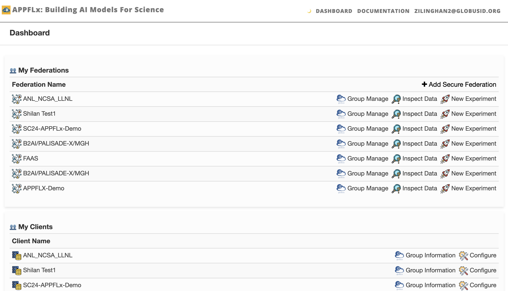

Create Federation
=================

This page describes how to create a federated learning group (federation) and invite collaborators.

1. Log in to the `web application <https://appflx.link>`_ by following the instructions. 

2. You will be directed to a dashboard page after signing in. The dashboard lists your **Federations** and your **Clients**. Specifically, federation refers to the FL group that you created, namely, you are the group leader who can start FL experiments and access the experiment results. Clients refers to the FL group of which you are a member. The federation leader is also a client of his own federation by default.

3. To create a federation, click **+ Add Secure Federation** button on the dashboard, and follow the instruction in **Create Globus Group** to create a Globus group for federated learning, and then copy the group UUID to **Group ID**. 

4. Click **Save** and then you can see your newly created group in the dashboard.

5. To invite collaborators to join the federation, go to the dashboard page and click **Group Manage** button next to your created federation, and this will open the Globus group management page. Click **Members** tab on the top, and then click **Invite Others to Join** on the top right. Then you can invite your collaborators by typing their name or email address.