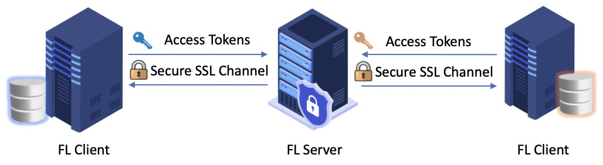

How to run FL over secure RPC
=============================

This describes how to run federated learning using gRPC with authentication by running FL-server and FL-client. The following figure illustrates the gRPC communication with token-based authenticator.

As access tokens are transferred from clients to server for authentication, secure SSL channel is required for gRPC communication to encrypt the transmitted data. In each RPC from client to server, the client will attach its authentication token as call metadata and send to the server for validation. APPFL currently supports two types of authenticators `NaiveAuthenticator` for demonstration purposes and `GlobusAuthenticator` for real deployment. Please refer to the `authenticator documentation <../../src/appfl/login_manager/ReadME.md>`_ to learn more about the authenticators and how to define your own authenticator if needed.

In the following two notebooks, we will use the `NaiveAuthenticator` for easy demonstration, which the client simply uses hardcoded authentication tokens for validation.

.. toctree::
    :maxdepth: 1

    launch_server_auth.ipynb
    launch_client_auth.ipynb
