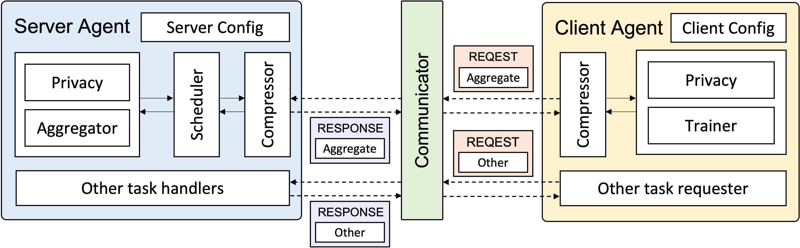

User Guide
==========

Framework Overview
------------------

In the design of the APPFL framework, we essentially create the *server agent* and *client agent*, using the six technical components above as building blocks, to act on behalf of the FL server and clients to conduct FL experiments. Specifically, 

* APPFL Server Agent: 

  * Server Config: The server configuration is provided as a single yaml file which contains not only configuration for the FL server, such as aggregator and scheduler configurations, but also configurations that apply for all clients, such as local trainer type and configurations and model architectures, which will be broadcasted to all clients at the beginning of FL experiments.
  * Compressor: If the experiment enables compression, the compressor component is used to decompress the model sent from the clients before global aggregation. 
  * Scheduler: The scheduler component handles the different arrival times of client local models, which controls the synchronism of the experiments. For example, the synchronous scheduler only passes client local models to the aggregator after all models arrive, while the asynchronous scheduler passes each client model to the aggregator immediately after it arrives.
  * Aggregator: The aggregator component takes one or more client local models, depending on the synchronism of the experiment, to update the global model.
  * Privacy: The privacy component at the server side works with the privacy component at the client side together to  provide an additional layer of protection againist data leakage.
  * Other task hanlders: In addition to the global aggregation, the FL server may also need to do other orchestration tasks, e.g., providing client-related configurations to clients. User can also define their own task handlers for their customization choices.

* APPFL Clinet Agent: 

   * Client Config: The client configuration is also provided as a yaml file for each client which contains client-specific configurations (e.g. dataloader for data on-premise), as well as uniform client configurations received from the server.
   * Compressor: If the experiment enables compression, the compressor component is used to compress the model parameters before sending to the server.
   * Trainer: The trainer component trains the machine learning model using each client's local data according to the training configurations in the client configuration.
   * Privacy: The privacy component provide an additional layer of protection againist data leakage.

* APPFL Communicator: The communicator is used for exchanging model parameters as well as metadata between the server and clients. We currently support the following three communication protocols for different use cases.
    
  * MPI: Used for simulating FL experiment on one machine or HPC cluster.
  * gRPC: Used for both simulating FL experiments on one machine or HPC, and running FL experiments on distributed machines. It can be integrated with several authentication strategies to authorize the clients for secure FL experiments.
  * `Globus Compute <https://funcx.readthedocs.io/en/latest/index.html>`_: Used for easily running FL experiments on distributed and heterogeneous machines. It is integrated with Globus authentication to authorize the clients for secure FL experiments.

APPFL Components
----------------

.. toctree::
   :maxdepth: 2
   :titlesonly:

   technical_components

User and Developer Guide
------------------------

.. toctree::
   :maxdepth: 2
   :titlesonly:

   user_run
   ../developer/index