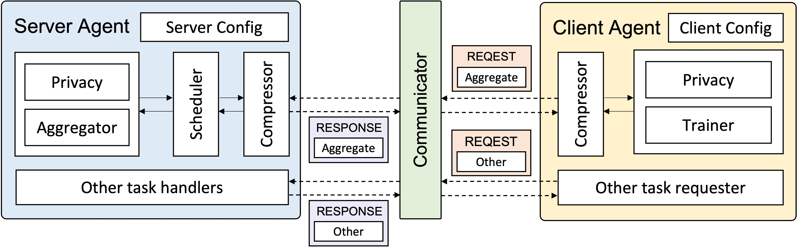

APPFL Components
================

In the design of the APPFL framework, we essentially create the *server agent* and *client agent* using six main building blocks (Aggregator, Scheduler, Trainer, Privacy, Communicator, and Compressor) to run various FL experiments.

First, let's take a look at the server agent, client agent, and communicator on a high level.

.. toctree::
   :maxdepth: 1
   :titlesonly:
   
   server_agent
   client_agent
   communicator

Now, let's take a look at the building blocks that make up the server agent and client agent in more detail.

.. toctree::
   :maxdepth: 1
   :titlesonly:
   
   aggregator
   scheduler
   trainer
   privacy
   compressor
