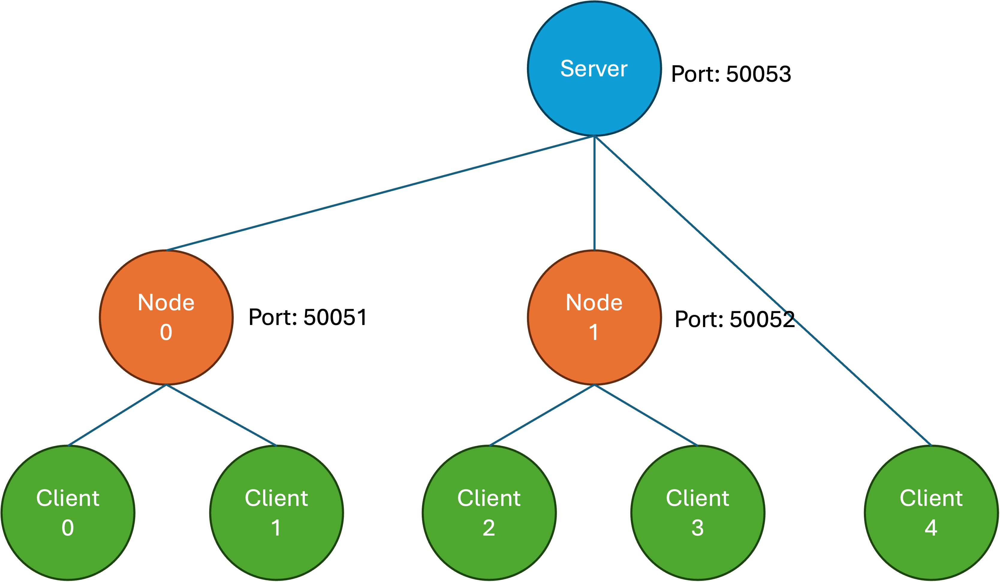

# Basic HFL

## Topology

<p align="center">
  
</p>

## How to Run?

Open first terminal to launch the server
```bash
python hfl/run_server.py --config ./configs/hfl/server.yaml
```

Open the second terminal to launch node 0
```bash
python hfl/run_node.py --config ./configs/hfl/node_0.yaml 
```

Open the third terminal to launch node 1
```bash
python hfl/run_node.py --config ./configs/hfl/node_1.yaml
```

Finally, you can open the fourth terminal to run all five clients together
```bash
python hfl/run_client.py --config ./configs/hfl/client_0.yaml &
python hfl/run_client.py --config ./configs/hfl/client_1.yaml &
python hfl/run_client.py --config ./configs/hfl/client_2.yaml &
python hfl/run_client.py --config ./configs/hfl/client_3.yaml &
python hfl/run_client.py --config ./configs/hfl/client_4.yaml &
```

## Run Together

Of course, you can run all in open terminal (though this means that the outputs for all will be shown in a single terminal and can be a bit messy...)

```bash
python hfl/run_server.py --config ./configs/hfl/server.yaml &
python hfl/run_node.py --config ./configs/hfl/node_0.yaml &
python hfl/run_node.py --config ./configs/hfl/node_1.yaml &
python hfl/run_client.py --config ./configs/hfl/client_0.yaml &
python hfl/run_client.py --config ./configs/hfl/client_1.yaml &
python hfl/run_client.py --config ./configs/hfl/client_2.yaml &
python hfl/run_client.py --config ./configs/hfl/client_3.yaml &
python hfl/run_client.py --config ./configs/hfl/client_4.yaml &
```