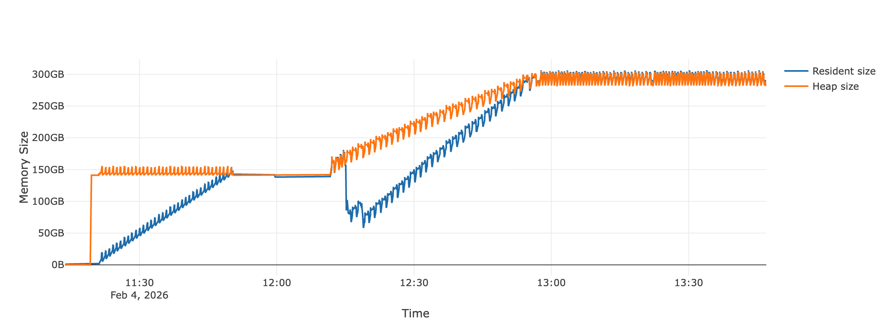
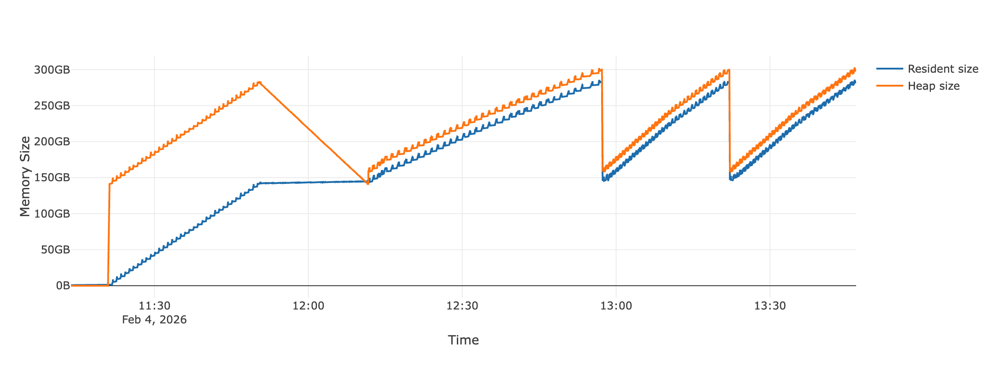

# Memory Optimization using Chunked Model Transmission and Aggregation

To further optimize memory usage during federated learning with large models, we have implemented chunked model transmission and aggregation. This approach breaks down large model parameters into smaller chunks, reducing peak memory consumption on both the server and client sides.

## 🚀 1. How to Run (Single Node - 8B Model)

You can easily leverage the script provided in `examples/memory_profiling/run_llm_experiment.sh` to execute the memory profiling experiments for large language models (LLMs) with and without chunked model transmission. 

**💡Note**: You can change `NUM_CLIENTS` in `run_llm_experiment.sh` to simulate different number of FL clients without needing to change anything else, including the configuration file. The script will help you handle anything.

```bash
cd examples
chmod +x memory_profiling/run_llm_experiment.sh
./memory_profiling/run_llm_experiment.sh
```

### Explanation of the Script

#### Configurations

The script launches one server and serveral clients of your choice and runs the optimized version of FL training on LLM. The server uses the configuration file `examples/memory_profiling/configs/server_llm_dummy.yaml`, as shown below, which uses a newly defined dummy LLM trainer ([`DummyLLMTrainer`](../../src/appfl/algorithm/trainer/llm_dummy_trainer.py) - it does nothing but loading and returning the large LLM). 

To enable the new optimization, you need to set `use_model_chunking: True` in the gRPC communication configurations for both the server and clients. You can specify the maximum size for each chunk via `model_chunk_size`, and it is recommended to ensure the chunk size is same for server and clients. Here, we are using a chunk size of 4GB, which means each chunk contains parameters adding up to a maximum of 4GB.

The model used in this example is Meta's Llama 3.1 8B model, which is loaded via huggingface using the script in [`examples/resources/model/hf_llm.py`](../resources/model/hf_llm.py). 

```yaml
# configs/server_llm_dummy.yaml
client_configs:
  train_configs:
    trainer: "LLMDummyTrainer"

  model_configs:
    model_path: "./resources/model/hf_llm.py"
    model_name: "load_hf_llm"
    model_kwargs:
      model_name: "meta-llama/Llama-3.1-8B"

server_configs:
  num_clients: 2 # This will be changed by the scripts automatically
  scheduler: "SyncScheduler"
  scheduler_kwargs:
    same_init_model: True
  aggregator: "FedAvgAggregator"
  aggregator_kwargs:
    client_weights_mode: "equal"
  device: "cpu"
  num_global_epochs: 3
  logging_output_dirname: "./output"
  logging_output_filename: "result"
  comm_configs:
    grpc_configs:
      server_uri: localhost:50051
      max_message_size: 104857600  # 100MB for LLM parameters
      use_ssl: False
      use_model_chunking: True # Enable chunked model transmission
      model_chunk_size: 4294967296  # 4GB
```

As for the configuration, its data configurations are not very relevant for this case as the dummy trainer does not use any data. The clients use the configuration files `configs/client_1_llm_dummy.yaml` as a base configuration file, which are similar to the server configuration in terms of enabling chunked model transmission. The running script will update the `client_id` and other relevant fields for different clients.

It should be noted that the `use_model_chunking` flag must be consistently set to `True` to enable chunked model transmission and aggregation. The chunk size can be set via `model_chunk_size`.

```yaml
# configs/client_1_llm_dummy.yaml
client_id: "Client1"
train_configs:
  # Device
  device: "cpu"  # Use CPU for consistent memory profiling
  # Logging and outputs
  logging_output_dirname: "./output"
  logging_output_filename: "result"

# Dummy dataset configuration
data_configs:
  dataset_path: "./memory_profiling/dummy_cifar10_dataset.py"
  dataset_name: "get_dummy_cifar10"
  dataset_kwargs:
    num_clients: 2
    client_id: 0
    samples_per_client: 64  # Very small dataset to isolate training memory

comm_configs:
  grpc_configs:
    server_uri: localhost:50051
    max_message_size: 104857600  # 10MB for ResNet parameters
    use_ssl: False
    use_model_chunking: True # Enable chunked model transmission
    model_chunk_size: 4294967296  # 4GB
```

### Output

The script will generate memory profiling files for the optimized version with chunked model transmission. 

## 🚀🚀 2. How to Run (Multi Nodes - 70B Model)

For 8B models, we are simply using a shell script to run both the FL server and FL clients on a single node, as they won't use too much memory. However, to run 70B models, we need to use multiple nodes and have the server and each client operate on an exclusive node to avoid OOM issue. 

There are no configuration changes, the only thing you need is the model name (and maybe the `model_chunk_size` if you prefer, although 4GB should work for 70B models). Here, we just provide an example batch submission script at `bash_submission_large.sh` for your reference to show how to launch the experiments.

The script is running on the [Polaris](https://docs.alcf.anl.gov/polaris/getting-started/) machine at ALCF, using PBS job scheduling system. Also, as Polaris compute node cannot accept incoming connections, we are seting up SSH tunneling to allow communication between the server and clients. In the xample script, the number of clients is equal to the number of allocated nodes minus one.

### Results

Both the server and client are able to run on a node with 512 GB memory.

Server Memory Usage (Peak: 309.8GB)


Client Memory Usage (Peak: 302.6GB)
