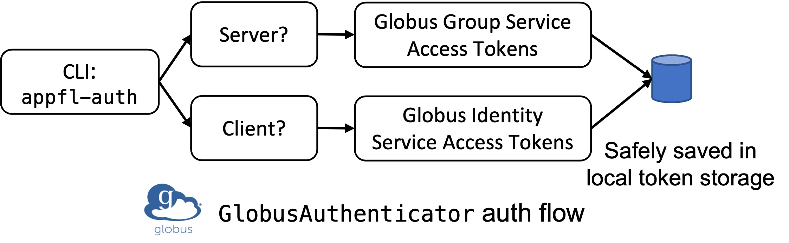

# 🔐 APPFL Login Manager

The `appfl.login_manager` package provides token-based authenticators for federated learning experiments running in gRPC communication protocols, which can help the FL server to validate the connected clients.

All provided authenticators inherit from the following `BaseAuthenticator` class, and should define two functions. Therefore, to integrate your own authenticator, you just need to define `YourOwnAuthenticator` following the given protocol.
- `get_auth_token()`: Invoked by an FL client to obtain authentication token(s) as python `dict`. The key and value of the dictionary must be `str` as required by gRPC.
- `validate_auth_token()`: Invoked by the FL server to validate the provided authentication token(s) provided by clients.

```python
class BaseAuthenticator:
    @abc.abstractmethod
    def get_auth_token(self) -> Dict[str, str]:
        """Obtain authentication token(s) in a python `dict` format."""
        pass

    @abc.abstractmethod
    def validate_auth_token(self, token: Dict) -> bool:
        """Validate the authentication token. Return `True` if the token is valid, `False` otherwise."""
        pass
```

## Naive Authenticator
Currently, we provide the two authenticators,
- [`NaiveAuthenticator`](naive)
- [`GlobusAuthenticator`](globus)

`NaiveAuthenticator` simply uses hardcoded token for demonstration purposes.

```python
class NaiveAuthenticator(BaseAuthenticator):
    """
    A naive authenticator that uses a hardcoded token for authentication.
    It is only used for demonstration purposes.
    """
    def get_auth_token(self) -> Dict[str, str]:
        return {
            "auth_token": "appfl-naive-auth-token"
        }

    def validate_auth_token(self, token: dict) -> bool:
        return token.get("auth_token") == "appfl-naive-auth-token"
```

## Globus Authenticator
`GlobusAuthenticator` employs the Globus authentication service to use a certain Globus group as the secure federation. Namely, only clients within a server-specified Globus group can join the federated learning experiment s(server must be the admin/manager of the specified Globus group).

### Create Globus Group
To create a secure Globus group for federated learning experiment:
- The server needs to
    - Login/Create a [Globus](https://www.globus.org/) account. (Highly recommended to use institutional login to associate yourself with your institutional email. If you do not find your institution in Globus, create a Globus ID using your institutional email.)
    - Go to the [Globus Group](https://app.globus.org/groups) service and click **Creat new group** button on the upper right. Fill out the group name and other information according to your preferences.
    - Click the created group, click the **Members** tab, and click **Invite Others**. Then invite any client you want to include in the FL experiment by entering their institutional email.
    - Go back to the created group, and copy the **Group UUID**.
- The client needs to
    - Login/Create a [Globus](https://www.globus.org/) account. (Again, better to use institutional login or institutional email.)
    - Accept the Globus group invitation.

### APPFL Globus Login
To use the created Globus group as a secure federated, the FL server and all FL clients are required to do a *one-time* login to Globus for APPFL. The login is through a command `appfl-auth`, as shown in the following example.

`appfl-auth` will first prompt to ask whether you want to login for FL server or FL client. Select 1 if you will take the server role for the FL experiment, and 2 if you will be one of the clients. You can login to different Globus accounts for FL server and FL client, if you need so.

When you need to login to your Globus account, you will be provided a web link where you can login to Globus and get an authentication code. Copy the code and enter it in the command line.

If you have already logged in as an FL server/client, you can either logout (Option 1), change to another account (Option 2), or do nothing (Option 3).


```bash
(APPFL) ✗ appfl-auth
Please select whether you are authenticating for the federated learning server or client (Enter 1 or 2)
-------------------------------------------------------------------------------------------------------
1. Federated learning server
2. Federated learning client
-------------------------------------------------------------------------------------------------------
1
You have already logged in as a federated learning server
You can either logout (1), change to another account (2), or just exit (3)
-------------------------------------------------------------------------------------------------------
1. Logout
2. Change to another account
3. Exit
-------------------------------------------------------------------------------------------------------
2
Please authenticate with Globus here
------------------------------------
https://auth.globus.org/v2/oauth2/authorize?client_id=...
------------------------------------

Please enter the authorization code you get after login here: PLEASE_ENTER_YOUR_AUTH_CODE
-------------------------------------------------------------------------------------------------------
```

### Create Globus Authenticator for gRPC Communication
After creating a Globus group, inviting clients for collaboration, and logging in to Globus for APPFL, you are well prepared to use the Globus authenticator to protect the security of your FL experiment by ensuring the experiments are only conducted among members of a certain Globus group.

Below shows the interface of `GlobusAuthenticator`, which shows that the class takes two parameters during initialization.
- `is_fl_server`: Whether this authenticator is used for FL server or not.
- `globus_group_id`: Only the FL server needs to provide this parameter, and it is the **Group UUID** of the created Globus group, among which you would like to conduct FL experiments.

```python
class GlobusAuthenticator(BaseAuthenticator):
    """
    Authenticator for FL server and client using Globus Auth.
    :param is_fl_server: Whether the authenticator is for the FL server or client.
    :param globus_group_id: The Globus group ID for the federation. This is only required if `is_fl_server` is `True`.
    """
    def __init__(
            self, *,
            is_fl_server: bool = False,
            globus_group_id: Optional[str] = None
    ) -> None:
```

The `GlobusAuthenticator` created by the server will be used in the server's [`serve()`](../comm/grpc/serve.py) function for gRPC communication, and the the `GlobusAuthenticator`created by the client will be used to create the gRPC channel - [`create_grpc_channel()`](../comm/grpc/channel.py) - for communication with the server.

If you are using the provided `run_grpc_server.py` and `run_grpc_client.py` scripts, then just make sure you have filled the `authenticator_kwargs` with the right arguments for the client and server in the `Config` object, and set `authenticator='Globus'`.

```python
authenticator: str = "Globus" # "Globus" or "Naive"
server: DictConfig = OmegaConf.create({
    ...
    "authenticator_kwargs": {
        "is_fl_server": True,
        "globus_group_id": "77c1c74b-a33b-11ed-8951-7b5a369c0a53",
    },
    ...
})
client: DictConfig = OmegaConf.create({
    ...
    "authenticator_kwargs": {
        "is_fl_server": False,
    },
    ...
})
```

### [Optional] Auth Flow for Globus Authenticator
Note: Above contains all the information you need to know to secure you FL experiments using Globus authentication. This subsection contains additional information about the auth flow of the provided Globus authenticator, including
- What happens when a user login as an FL server/client?
- How does the client obtain auth tokens for server validation (i.e. how does `get_auth_token()` work)?
- How does the server validation client auth tokens (i.e. how does `validate_auth_token()` work)?

The figure below shows the auth flow during the user login process. When a user wants to login as an FL server, then APPFL requires for the access to user's Globus Group Service and obtain the tokens if user logs in and allows the access. When a user wants to login as an FL client, then APPFL requires for the access to user's Identity Information and obtain tokens if use logs in and allows the access. All tokens are safely saved in a local SQLite token storage at the `~/.appfl` directory

<p align="center">
  
</p>

For the logged in FL client, `get_auth_token()` simply returns the token obtained tokens for user identity information. [It is save to transmit those access tokens as the usage of `GlobusAuthenticator` in gRPC communication requires a secure SSL channel, so all transmitted data are safely encrypted.]

For the logged in FL server, `valiate_auth_token()` function takes three steps to validation the client identity:
- Use the retrieved Globus Group Service access token to get all the client IDs for all clients in the specified Globus group
- Take the Globus Identity access token provided by clients to get the client ID for that client
- Check if the client ID belongs to the specified Globus group
